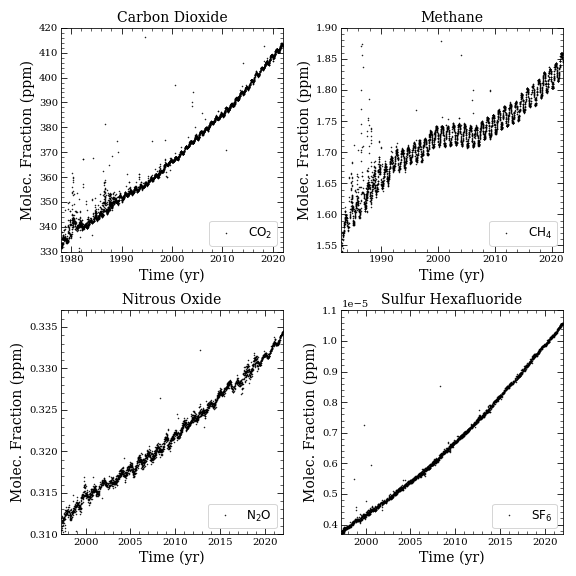

# Visualizing Greenhouse Gases
Plotted greenhouse gases from flask samples provided from Palmer Station, Antarctica, United States. This notebook shows a brief introduction into plotting observed atmospheric data.

In specific, we plot the carbon cycle gas species alongside their respective citations:
 1. Carbon Dioxide ($\mathrm{CO}_2$): Lan, X., E.J. Dlugokencky, J.W. Mund, A.M. Crotwell, M.J. Crotwell, E. Moglia,  M. Madronich, D. Neff and K.W. Thoning (2022), Atmospheric Carbon Dioxide Dry  Air Mole Fractions from the NOAA GML Carbon Cycle Cooperative Global Air  Sampling Network, 1968-2021, Version: 2022-11-21, https://doi.org/10.15138/wkgj-f215,
 2. Methane ($\mathrm{CH}_4$): Lan, X., E.J. Dlugokencky, J.W. Mund, A.M. Crotwell, M.J. Crotwell, E. Moglia,  M. Madronich, D. Neff and K.W. Thoning (2022), Atmospheric Methane Dry Air Mole Fractions from the NOAA GML Carbon Cycle Cooperative Global Air Sampling Network,  1983-2021, Version: 2022-11-21, https://doi.org/10.15138/VNCZ-M766,
 3. Nitrous Oxide ($\mathrm{N_{2}O}$): Lan, X., E.J. Dlugokencky, J.W. Mund, A.M. Crotwell, M.J. Crotwell, E. Moglia,  M. Madronich, D. Neff and K.W. Thoning (2022), Atmospheric Nitrous Oxide Dry Air Mole Fractions from the NOAA GML Carbon Cycle Cooperative Global Air Sampling Network, 1997-2021, Version: 2022-11-21, https://doi.org/10.15138/53g1-x417,
 4. and Sulfur Hexafluoride ($\mathrm{SF_{6}}$):  Lan, X., E.J. Dlugokencky, J.W. Mund, A.M. Crotwell, M.J. Crotwell, E. Moglia,  M. Madronich, D. Neff and K.W. Thoning (2022), Atmospheric Sulfur Hexafluoride  Dry Air Mole Fractions from the NOAA GML Carbon Cycle Cooperative Global Air  Sampling Network, 1997-2021, Version: 2022-11-21, https://doi.org/10.15138/p646-pa37.

